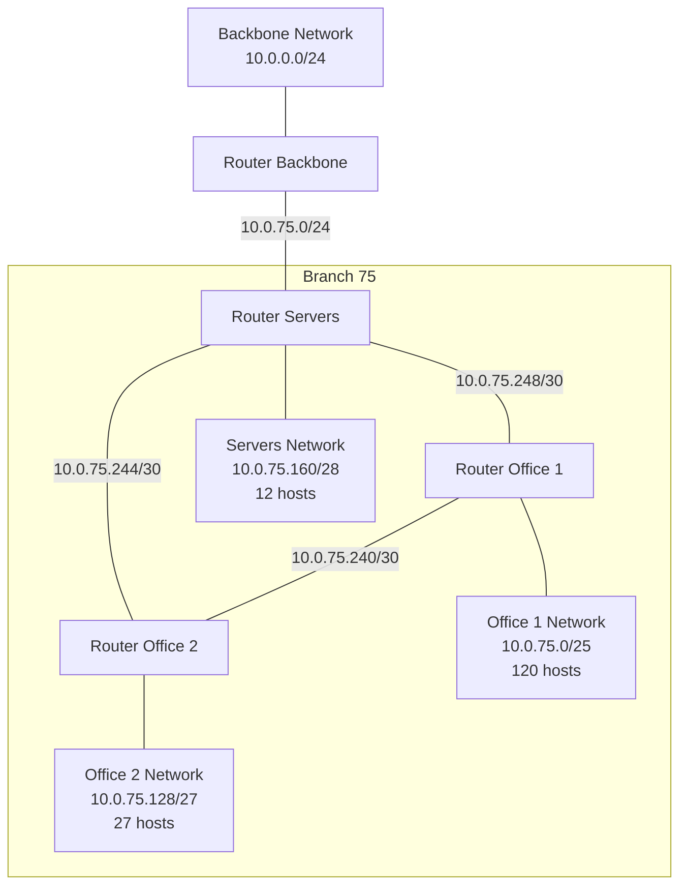

---
aliases:
  - Practica - Addressing Exercise - Topology Design
tags:
  - net
References: 
cssclasses:
---
# Topology Design
## Diagram:

```mermaid
graph TD
    BB[Backbone Network<br/>10.0.0.0/24] --- R_BB[Router Backbone]
    R_BB --- |10.0.75.0/24| R_S[Router Servers]
    
    subgraph Branch 75
        R_S --- |10.0.75.248/30| R_O1[Router Office 1]
        R_S --- |10.0.75.244/30| R_O2[Router Office 2]
        R_O1 --- |10.0.75.240/30| R_O2
        
        R_O1 --- O1[Office 1 Network<br/>10.0.75.0/25<br/>120 hosts]
        R_O2 --- O2[Office 2 Network<br/>10.0.75.128/27<br/>27 hosts]
        R_S --- SRV[Servers Network<br/>10.0.75.160/28<br/>12 hosts]
    end
```

***