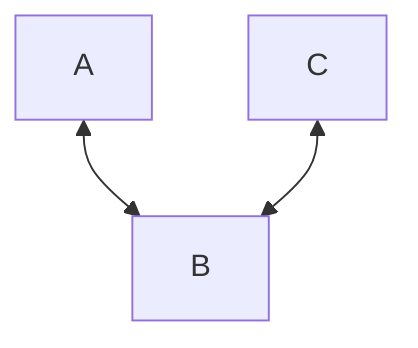
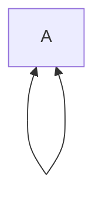

---
aliases:
  - Definition - Pseudograph
  - Pseudograph
tags:
  - discrete
"References:": 
cssclasses: 
sr-due: 2024-05-21
sr-interval: 4
sr-ease: 272
---

# Pseudograph:

> [!Note] Pseudograph
> A pseudo graph is defined by a nonempty set with all the vertices, a set with all the edges and a function $\gamma$ that defines the edge set as tuples of two vertices that are inside the vertex graph
$$
G = (V, E, \gamma)
$$
$$
\gamma: E\rightarrow \{\{u,v\}: u,v \in V\}
$$

**Remarks:**
+ We'll asume that the graph is undirected, this is why arrows go both sides, else it could be also written as a no arrow connection

+ We say that a graph has **multiple edges** when two edges are connecting the same two vertices: 

+ We say that a graph has **loops:** For an edge to start and end in the same node: 

## Properties of pseudo-graphs: 
### Degree:
The degree of valence of a vertex is represented by the number of edges that connect to it. 

The degree of a vertex v is represented as: 

$$
	d(v)
$$

**Remarks:**
+ **The loops contribute twice:f** 1 loop → two degrees 
+ If degree = 1. Then the vertex is **terminal**
+ If all vertices have degree 0 there are no edges. This graphs are called **trivial graphs**
+ If a vertex degree is 0, then this vertex is called **isolated**

## Types of pseudo-graphs: 
Given the following definition of a pseudograph and the different characteristics it may have we can define several types of pseudo-graphs:

+ [[20240515 - 022456 - Definition - Simple graph|Simple graph]]: **No multiedges, no loops**
+ Multigraphs: **Multiedges okay, no loops**
+ Regular graphs: **All vertices must have the same degree**
