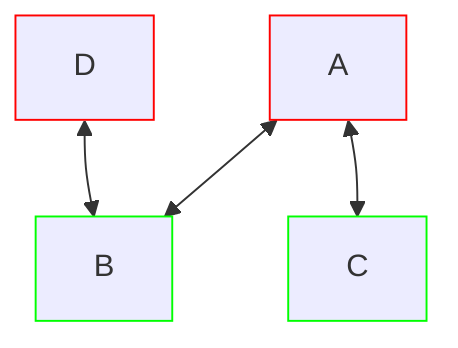

---
aliases:
  - Definition - Bipartite graph
  - Bipartite graph
tags:
  - discrete
"References:": 
cssclasses: 
sr-due: 2024-05-30
sr-interval: 10
sr-ease: 250
---

A graph is bipartite if it can be divided into two disjoint subsets such as every edge in the graph connects a vertex in one of the subsets with a vertex in the other one. 
 
 A concrete case of the bipartite graph is the complete bipartite graph of n vertices, where **all the vertices in one of the subsets are connected to all the ones in the other one**
 
 **Example:**
 This graph is bipartite: $V_1 = A,D; V_2 = B,C$ 
 

### Properties: 
+ For Cycle Graphs there need to be **an even number of vertices** in order for it to be bipartite.
+ Vertices can be disconnected and the graph would still be bipartite, only need to separe into the two teams
