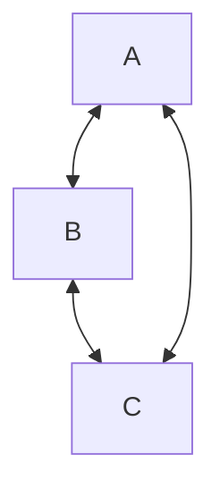

**NOT:** $K_n$ 

+ is a [Regular Graph](Regular%20Graph) 
	+ All vertices have the same degree
+ Every vertex is connected to every other vertex
### Properties: 

+ For a complete graph of n vertices, each vertex is connected to n-1 other vertices. And the number of edges in the graph can be computed using pairs of 2. 
$$
|E| =\binom {n}{2}
$$
### Example: 
A complete graph of n = 3 vertices

